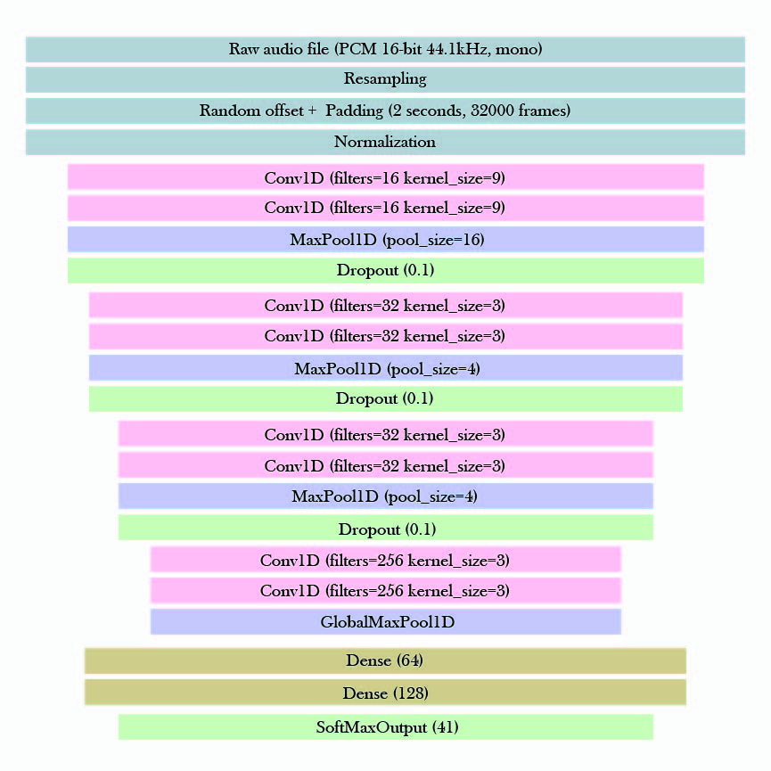
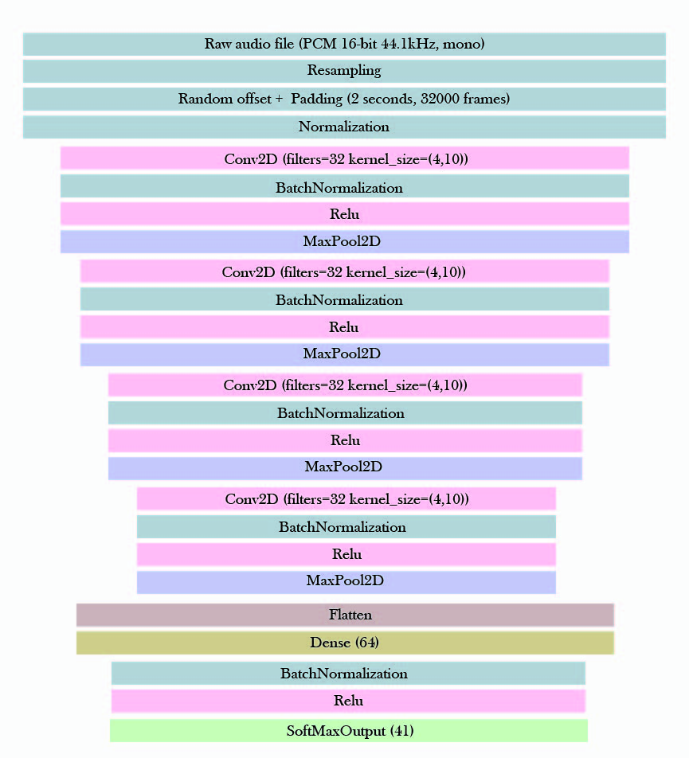

# Machine Learning (2018,Spring) Final Project

Team Member:

r06942018 何適楷   b04505021 黃廉弼  b04505026 蔡仲閔  b04901165 陳致維

## Dependency

This final project is dependent on Python 

- keras == 2.1.6
- librosa == 0.6.1
- numpy == 1.14.0
- pandas == 0.22.0
- matplotlib == 2.1.2
- requests == 2.18.4
- simplejson == 3.15.0
- scikit-learn == 0.19.1


## Usage

### Data Preprocessing (Data Generator) 

To use the data generator to append the dataset, do:

```shell
# To use the data generator you should decide 
# 2 paraneters : strech, num
python3 ./final/src/data_gen.py --strech 1.1 --num 5
```

### Training

To train a model, do:

```shell
# To use the train you should give the model you want to use:
cd ./final/src && ./train.sh 1d_conv
cd ./final/src && ./train.sh 2d_mfcc
```


### Predict

```shell
cd ./final/src && ./predict.sh ./final/model/1d_conv ./final/model/2d_mfcc
```


### Crawler the Rank on Kaggle

To check the rank in NTU, we write a python crawler:

``` shell
python3 ./final/ranking.py
```

## Model

### 1D Convolution
我們將音訊檔取sample之後直接將Raw Data餵進1D-CNN Model，中間經過多層架構並有MaxPooling提升訓練速度。而這樣的架構相當簡單，但缺點就是訓練時間非常長，因為我們並沒有對音訊檔做預處理，因此Data size極大，需透過data_generator每次load進Model中訓練，而file I/O次數變大幅增加，也拖垮整體訓練速度。


|                        |  epoch  | learning_rate | optimizer  |        loss_function         |  activation_function  |
| ---------------------- | ------- | ------------- | ---------- | ---------------------------- | --------------------- |
| 1D Convolution         |   50    |     0.0001    |    Adam    |   categorical_crossentropy   |          relu         |




### 2D Convolution on MFCC
在這裡則是較常見的做法，我們先將data透過MFCC做預處理在在將它餵進2D-CNN Model中，此時就接近一個我們熟悉的圖像辨識問題。而好處在於透過MFCC處理的資料不但Size較小且較接近人耳辨識聲音的方式，因此在這個模型上可以得到相當不錯的結果。


|                        |  epoch  | learning_rate | optimizer  |        loss_function         |  activation_function  |
| ---------------------- | ------- | ------------- | ---------- | ---------------------------- | --------------------- |
| 2D Convolution         |   50    |     0.0001    |    Adam    |   categorical_crossentropy   |          relu         |





## Reference

- [Beginner's Guide to Audio Data](https://www.kaggle.com/fizzbuzz/beginner-s-guide-to-audio-data)

- [More To Come. Stay Tuned](https://www.kaggle.com/codename007/a-very-extensive-freesound-exploratory-analysis)

- [Confusion Matrix on scikit-learn](http://scikit-learn.org/stable/auto_examples/model_selection/plot_confusion_matrix.html)

  ​
