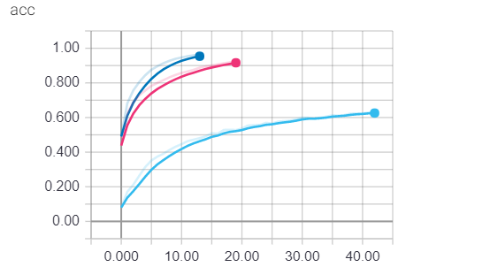
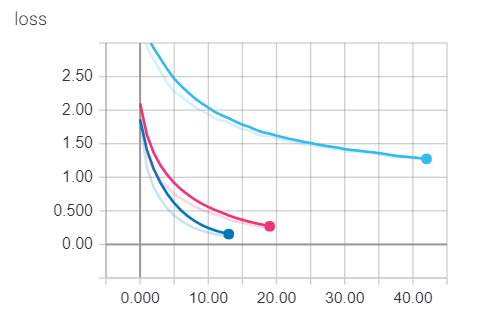
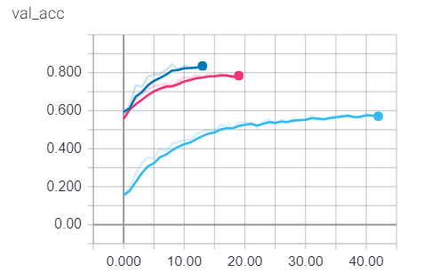
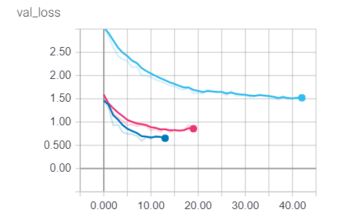

# Final Project Report

Team Member:

r06942018 何適楷  b04505021 黃廉弼 b04505026 蔡仲閔 b04901165 陳致維

## Introduction & Motivation 

由於智能管家的發展，聲音辨識算是現今ML的一大應用。

而音訊處理中，傅立葉轉換可說是其中相當重要的一個環節，即工學院基礎課程不斷出現的章節，現在相當是能應用所學的好機會。

加上本學期課程作業中沒有出現過以音訊處理為主題的作業，因此一個出於一個探索未知領域的好奇心，大家共識決定選擇音訊處理的題目當作報告主題。

為了探討各種樂器(廣泛來說)的不同，我們希望透過課程所學到的機器學習方法，來建立一定可靠度的模型能辨識出不同樂器的種類。並透過與kaggle平台上的高手們交流的過程得到良性的競爭。

## Data Preprocessing/Feature Engineering 

### Data Generator

Data Generator 主要分為兩個部分。第一個部分是對既有的訓練資料做一些小變化，
達到增加訓練資料的效果。第二個部分是做 normalization，降低訓練的困難度。

#### 第一部分:

* Time Streching
  隨機的將音訊檔案伸縮某個倍數
* Pitch shifting
  將整個音訊檔案的音高隨機的升降若干個半音
  同一份音訊的升降值皆相同
* Adding white noise
  對音訊檔案加入隨機音量的白噪音

#### 第二部分:

- Volume normalization

  將音訊的音量調整至固定大小。
  第一個版本是把音訊資料中數值的最大值跟最小值 normalize 到 0.5 跟 -0.5
  第二個版本是把音訊資料中數值絕對值的最大值 normalize 到 0.5，確保音檔資料的0點保持不變。
  	

- Fixing input length

  將音訊的時間長度調整至固定大小。
  第一個版本對長和短的音訊做不同的處理。對於比要求長度還要短的音訊，我們在音訊前後pad 0，
  也就是添入無聲的資料點。音訊前後加入的無聲長度比例是隨機的，只要求總音訊長度固定。對於
  比要求長度還要長的音訊，我們從隨機的位置開始，切一段符合長度要求的音訊出來。
  第二個版本對音訊的處理做了統合。對於比要求長度還要短的音訊，將音訊重複多次，直到音訊變得
  比要求長度還要長。如此一來所有的音訊都必定比要求長度長，之後便接著做第一版中對較長音訊所
  做的處理。

### MFCC (Mel Frequency Cepstral Coefficients)

MFCC 是一種相當常見的聲音預處理技術。我們是直接使用librosa套件中的 mfcc 函數，並未重新實作，
但我們還是對 MFCC 做了一定程度的了解後，才選用 MFCC 作聲音預處理。以下為 MFCC 對音訊做的
處理步驟，以及做各個步驟的理由與優點:

* Frame the signal
  從音訊資料每隔10ms切出20ms~40ms的小時間區段(frame)。這能幫助了解一個短時間尺度內的聲音特徵。若區段取的更短，將不利於下一個步驟 DFT 的準確度。若區段取的更長，聲音特徵可能已經在該區段內發生太大的變化。
* Discrete Fourier Transform
  對每一段時間區段做piriodic-based DFT，取得該區段的功率頻譜。由於人耳的耳蝸會在不同的頻率振動，
  並將之轉換為神經訊號傳至腦部，以頻譜作為分析聲音特徵的基礎相當常見。


- Compute Mel-spaced filterbank energies (log scale)
  Mel-spaced filterbank 為一系列(20~40個)波形為三角波，位於不同頻段的濾波器。
  將每一段時間區段的功率頻譜乘上 filterbank 做積分，取得該區段在不同頻段下的能量值。
  這是因為人耳並不能分辨微小的音高變化，且在越高的頻率越不容易分辨。Mel filterbank的設計便是越高頻
  的濾波器的頻帶越長，利用這種濾波器做積分，能有效的減少資料量，同時給出不同頻段內的能量值。


- Take the logarithm 
  並將各個能量值取對數，得到不同頻段的分貝數。這是因為人耳對音量的感知不是線性而是指數的。


- Discrete Cosine Transform
  對一個時間區段中各個頻段的分貝數做 DCT，得到倒頻譜係數，並只保留前半段的係數。做 DCT 是為了做資料的去相關性，因為 Mel filterbank 之間是有重疊頻帶的，所以不同頻段的分貝數相關性很高。而只保留前半段的係數是為了增加音訊的平滑性，後半段的係數都是高頻的項，對於音訊處理的幫助不大，還有可能造成神經網路overfit，所以直接丟棄。

經由上述步驟所得到的係數，即為 MFCC。


## Model Description
此章節主要介紹我們使用的Model，而實際訓練結果將在Experiment章節討論。
在這個task中我們主要使用兩種Model，分別是1D-CNN以及2D-CNN on MFCC。一開始有考慮使用RNN進行訓練，但最後仍選擇使用CNN，主要是考慮到因為音訊檔某個程度上具有時序性的關係，但這次的task並非語意辨識那樣有次序調換影響結果的關係，因此透過CNN的filter就可以將其時序相關性表現出來。其中我們訓練都使用StratifiedKFold進行分層採樣，確保validation set中各類型資料比例和training set相同，並分別進行十次訓練，最後再進行ensemble.
### 1D Convolution
我們將音訊檔取sample之後直接將Raw Data餵進1D-CNN Model，中間經過多層架構並有MaxPooling提升訓練速度。而這樣的架構相當簡單，但缺點就是訓練時間非常長，因為我們並沒有對音訊檔做預處理，因此Data size極大，需透過data_generator每次load進Model中訓練，而file I/O次數便大幅增加，也拖垮整體訓練速度。


|                        |  epoch  | learning_rate | optimizer  |        loss_function         |  activation_function  |
| ---------------------- | ------- | ------------- | ---------- | ---------------------------- | --------------------- |
| 1D Convolution         |   50    |     0.0001    |    Adam    |   categorical_crossentropy   |          relu         |


### 2D Convolution on MFCC
在這裡則是較常見的做法，我們先將data透過MFCC做預處理在在將它餵進2D-CNN Model中，此時就接近一個我們熟悉的圖像辨識問題。而好處在於透過MFCC處理的資料不但Size較小且較接近人耳辨識聲音的方式，因此在這個模型上可以得到相當不錯的結果。


|                        |  epoch  | learning_rate | optimizer  |        loss_function         |  activation_function  |
| ---------------------- | ------- | ------------- | ---------- | ---------------------------- | --------------------- |
| 2D Convolution         |   50    |     0.0001    |    Adam    |   categorical_crossentropy   |          relu         |


## Experiment and Discussion
### Data Preprocessing
音訊處理並沒有像圖片一樣可以直接丟進一個CNN Network去處理，中間我們遇到很多問題，像是音檔的長度範圍過大，很容易造成照顧了短檔，忽略的長檔，或是照顧了長檔，但是忽略的短檔，還有在normalize中間其實也存在跟圖片處理不同的狀況。從作業我們也知道，data argumentation的成長幅度是驚人的，所以我們一開始也就把重心放在data argumentation，果真如我們所料，data argumentation所帶來的成果是相當顯著的，接下來我們會介紹我們遇到的問題與解決的方法。
#### Sampling Rate
人耳一般能聽到的聲音範圍極限大約是20kHz，我們選用的取樣頻率是44kHz從Nyquist theory得到最大能表現的頻率是22kHz，這樣使得能表現的頻率略高於人耳能聽見的頻率，讓人耳接受到的資訊完整呈現給機器處理，
#### Volume normalize
一開始，我們使用最一般的normalization
```python
def audio_norm(data):
    max_data = np.max(data)
    min_data = np.min(data)
    data = (data-min_data)/(max_data-min_data+1e-6)
    return data-0.5
```
但是後來想到這種方法有可能使得原本是0的地方(無聲)變成另一個constant，這對於mfcc有不好的影響，因為mfcc用了一種類似人耳處理音訊的方法，一個offset可能對於mfcc有不良的影響，所以我們改成下列的normalization
```python
def audio_norm(data):
    max_data = np.max(np.absolute(data))
    return data/(max_data+1e-6)*0.5
```
這種方法就單純把音量normalize，盡量讓音訊原汁原味地送給mfcc。得到的成果也是豐碩的。

| 方法 | testing error on mfcc |
| :-------: | :-----: |
| 一般的normalization | 0.857 |
| 只調音量的normalization | 0.882 |

直接進步了3%。另外我們也用這個方法應用在1D convolution的model，但是並沒有進步，我們的推測是其中的neuron自帶有offset的功能，所以能夠進而調整，不像2D 的model需要經過mfcc，故沒有顯著的進步效果。
#### Audio file repeat, offset, and cut
因為model在吃參數的時候，必須要是相同格式，我們必須把所有音檔都轉換成相同長度，我們選擇2秒當作一個標準長度，一開始我們處理的方式如下:

* 如果比2秒還長，我們在這個音檔中隨機取一個2秒的片段
* 如果比2秒還短，我們把音檔隨機放在一個2秒的某個位置，剩下補0

但是我們想到，如果音檔本身很短，是不是有造成整個音檔大部分都是0，所以我們改用以下方法

* 如果比2秒還長，我們在這個音檔中隨機取一個2秒的片段
* 如果比2秒還短，我們把音檔自己重複使得長度剛好超過2秒，之後再隨機取2秒的片段

這種方法可以使得音檔完整呈現在data裡面。

#### Audio duration
經過音檔重複的處理，我們顧及到了音檔過短的問題，但是還是有少部分音檔是遠遠大於2秒的，為了也讓長音檔也能更完整呈現原本的資訊，我們把音檔的標準長度從2秒提升到4秒，綜合上述對音檔資訊的表現得處理，我們得到以下結果：

| 方法 | testing accuracy on mfcc |
| :-------: | :-----: |
| 原始方法 | 0.914 |
| 處理過後 | 0.925 |

得到顯著的進步！

### Data Generator
#### Pitch shift
我們利用librosa內建的function `librosa.effects.pitch_shift` 去實現，一開始我們將所有音量都隨機調整正負一個8度，但是並沒有得到好的結果，後來我們覺得可能頻率移動太多，某些音檔可能已經變得無法辨識，所以我們從正負一個8度調整到正負0.3度，可是依然無法得到明顯進步的結果，所以我們就放棄這個方法了，我們推測mfcc中的某一步，利用三角形的函數與經過處理的頻域資料做類似convolution的處理，會自然產生對頻率的容忍度，所以使用這種方法不能為機器提供額外有用的資訊。
#### Noise
從課堂中我們學到，在data中適當的加入noise可以增加model的robusticity，所以我們加入最大音量5%的white noise，可惜的也沒有得到顯著的進步，之後我們把noise的level又調到1%，但是依然沒有得到進步的結果。我們推測所有音檔(包含testing、training)都收音蠻好的，幾乎沒甚麼雜訊，機器在判斷的時候，noise反而沒辦法得到好處。
#### Time strech
我們另外想到的方法是，隨機調整音檔的長度，使其產生更多相似的data，我們使用的是`librosa`這個library內的`librosa.effects.time_stretch`這個function，這個function可以把音檔調快或調慢，我們一開始讓聲音快慢範圍在0.5倍至2倍之間隨機選擇，可是並沒有得到進步的結果，我們想到有可能是範圍過大，導致有些音檔的資訊完全扭曲，所以我們進一步調整音檔快轉/慢轉的係數，最後決定在1.1倍至0.9倍這個數字最適合。
一開始我們是每個音檔，產生2個隨機放慢或放快的的音檔，因為得到好的成果，我們進一步從隨機2個，改至隨機4個，實踐data argumentation的精神，果真也有顯著的進步。
我們同樣也對1D Convolution model做相同的運算，但是並沒有得到明顯的進步。但是跟1D Convolution model emsembled之後，testing accuracy還是有上升的效果。

| 方法 | testing accuracy on mfcc(ensembled) |
| :-------: | :-----: |
| 使用原始data | 0.902 |
| 使用Time strech 隨機量=2 | 0.911 |
| 使用Time strech 隨機量=5 | 0.914 |

因為若再調大，記憶體將無法負荷了，所以我們並沒有再繼續增加data argumentation的量，不過我們相信，還是有進步空間的。
### Model 
這次使用的兩個Model中，其中1D Convolution訓練時間長
#### Comparison
在這邊我們將比較兩種不同的Model的表現，其中 2D Convolution 我們也又進行參數調整， 將filter數增加一倍，並增加Dropout Layer以避免模型過擬和，而在單一模型中也可以看到明顯提升，但ensemble之後提升較不明顯。我們以下的Accuracy及Loss都將取最後一次訓練的資料來做比較。

|                            |  acc   | loss   | val_acc | val_loss | time   |   color   |
| -------------------------- | ------ | ------ | ------- | -------- | ------ | --------- |
| 1D Convolution             | 62.87% | 1.2810 | 57.28%  | 1.5240   | 14 hr+ |   blue    |
| 2D Convolution on MFCC     | 92.65% | 0.2700 | 79.11%  | 0.8567   | 2 hr   |   pink    |
| Big 2D Convolution on MFCC | 96.49% | 0.1536 | 84.93%  | 0.6516   | 3 hr   | dark_blue |

下面則是訓練過程，我們一樣取最後一次訓練做觀察。

|                 acc                 |               loss                   |               val_acc                   |         val_loss                            |
| ----------------------------------- | ------------------------------------ | --------------------------------------- | -------------------------------------------------- |
|  |  |  |   |


從上表可以看到1D Convolution 其實相當不好訓練，即便在TitanV的環境下仍要超過半天的時間，且Accuracy並不好，然而最後進行Ensemble時卻又不可或缺，總是能讓最好表現再上一層樓。

#### Ensemble

我們是原先是使用各自模型Predict後機率相乘的方式，但後來發現很有可能因Ensemble次數過多導致機率接近零，超出可表示範圍影響結果。因此我們採用將機率取log後相加的方法，也有效改善。

在Public Score上我們單一MFCC Model可以到達0.909的準確率，而經過和1D Model Ensemble後則可以到達0.925的準確率，相當有成效。
## Conclusion
經過我們多次嘗試，我們得出以下結論
* 對音量做normalize對mfcc有極大的幫助，對1D Convolution model並沒有顯著的效果，推測原因是1D Convolution model中的每個cell都具有常數項，能補足音檔offset，然後mfcc的一系列操作則對offset敏感，故在normalize的時候必須保持音量為0的地方為0。
* Noise對兩種model都沒有顯著的進步，我們推測這批音檔收音都不錯，所以Noise的效果並沒有很顯著。
* Pitch shift效果不明顯，我們推測mfcc中的類似convolution的步驟已經提供相似的效果，故結果不明顯。
* Time strech效果對mfcc有極大的幫助，可能的原因是這種伸縮對mfcc看起來像是全新的資料，但實際而言，卻是相似的聲音，故利用隨機性產生的大量Time strech data就會具有big data的效果。
* 對於音檔的處理，與其把較短的音檔多餘的部分補0，更好的方式是重複放入一樣的音檔。
* 增加標準音檔的長度會使準確率變高，我們認為是更能表現某些較長的音檔。
* 1D Convolution model 和 mfcc model 做 emsemble 通常能夠得到更好的model。
## Reference

- [Beginner's Guide to Audio Data](https://www.kaggle.com/fizzbuzz/beginner-s-guide-to-audio-data)

- [More To Come. Stay Tuned](https://www.kaggle.com/codename007/a-very-extensive-freesound-exploratory-analysis)

- [Confusion Matrix on scikit-learn](http://scikit-learn.org/stable/auto_examples/model_selection/plot_confusion_matrix.html)

  ​
